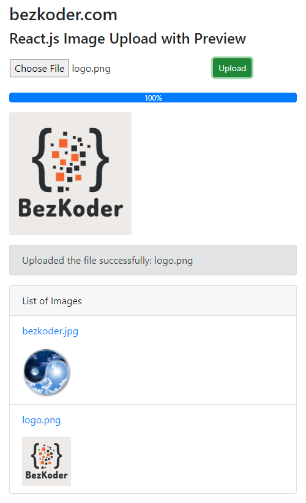

## React.js Image Upload with Preview using Hooks
Building React Hooks Image Upload example with Preview to a Rest API. The React App uses Axios and Multipart File for making HTTP requests, Bootstrap for progress bar. You also have a display list of images’ information (with download url).



For more detail, please visit:
> [React.js Image Upload with Preview example](https://www.bezkoder.com/react-image-upload-preview-hooks/)

> [React.js Multiple Images Upload with Preview](https://www.bezkoder.com/multiple-image-upload-react-js/)

Rest APIs server for this React Client:
> [Node Express File Upload Rest API example](https://www.bezkoder.com/node-js-express-file-upload/)

> [Node Express File Upload with Google Cloud Storage example](https://www.bezkoder.com/google-cloud-storage-nodejs-upload-file/)

> [Spring Boot Multipart File upload example](https://www.bezkoder.com/spring-boot-file-upload/)

More Practice:
> [React Image Upload example with Preview (Components)](https://www.bezkoder.com/react-image-upload-preview/)

> [Material UI Image Upload example with Preview](https://www.bezkoder.com/material-ui-image-upload/)

> [React Hooks Multiple File Upload example](https://www.bezkoder.com/react-hooks-multiple-file-upload/)

> [React CRUD example using Hooks](https://www.bezkoder.com/react-hooks-crud-axios-api/)

> [React Pagination using Hooks example](https://www.bezkoder.com/react-pagination-hooks/)

> [React Hooks: JWT Authentication & Authorization example](https://www.bezkoder.com/react-hooks-jwt-auth/)

> [React + Redux + Hooks: JWT Authentication & Authorization example](https://www.bezkoder.com/react-hooks-redux-login-registration-example/)

Fullstack with Node.js Express:
> [React + Node Express + MySQL](https://www.bezkoder.com/react-node-express-mysql/)

> [React + Node Express + PostgreSQL](https://www.bezkoder.com/react-node-express-postgresql/)

> [React + Node Express + MongoDB](https://www.bezkoder.com/react-node-express-mongodb-mern-stack/)

Fullstack with Spring Boot:
> [React + Spring Boot + MySQL](https://www.bezkoder.com/react-spring-boot-crud/)

> [React + Spring Boot + PostgreSQL](https://www.bezkoder.com/spring-boot-react-postgresql/)

> [React + Spring Boot + MongoDB](https://www.bezkoder.com/react-spring-boot-mongodb/)

Fullstack with Django:

> [React Hooks + Django Rest Framework](https://www.bezkoder.com/django-react-hooks/)

Integration (run back-end & front-end on same server/port)
> [Integrate React with Spring Boot](https://www.bezkoder.com/integrate-reactjs-spring-boot/)

> [Integrate React with Node.js Express](https://www.bezkoder.com/integrate-react-express-same-server-port/)

Serverless:
> [React Hooks Firebase CRUD App with Realtime Database](https://www.bezkoder.com/react-firebase-hooks-crud/)

> [React Hooks Firestore CRUD App example | Firebase Cloud Firestore](https://www.bezkoder.com/react-hooks-firestore/)

This project was bootstrapped with [Create React App](https://github.com/facebook/create-react-app).

### Set port
.env
```
PORT=8081
```

## Project setup

In the project directory, you can run:

```
npm install
# or
yarn install
```

or

### Compiles and hot-reloads for development

```
npm start
# or
yarn start
```

Open [http://localhost:8081](http://localhost:8081) to view it in the browser.

The page will reload if you make edits.
